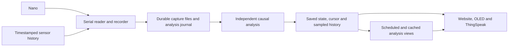

# Capture and saved-result architecture

The Pi records captures first. Independent analysis follows durable records in
capture order. The website, OLED and ThingSpeak consume the same saved, rated
result. Website visits do not run the continuous estimator.



## Services and responsibilities

- `pendulum-acquire` owns the serial port, protocol validation, command handling
  and coordinated recording. Its receive queue is bounded. A small independent
  heartbeat reports receive activity and queue occupancy while recording waits
  for disk. Disk synchronization and free-space accounting durations are exposed.
- `pendulum-sensors` records timestamped sensor snapshots in
  `sensor-history.sqlite3` and publishes current sensor health. As-of joins use
  the most recent snapshot preceding a capture receipt, within the same Pi boot.
  The journal retains up to two days, bounded by 64 MiB; pressure can shorten
  that horizon. Joined readings are retained in capture and analysis records.
  Timestamp cleanup uses an epoch index and deletes at most 2,048 expired
  snapshots per maintenance tick. The deployed sensor unit enables Python
  fault traces so a watchdog abort identifies the blocked Python call in the
  journal; a kernel I/O stall can still delay signal handling.
  Each BMP280 initialization discards its first pressure conversion, releases
  the bus, and waits at least 100 ms before publishing a reading. During this
  warm-up the channel is not healthy and any retained reading keeps its old
  timestamp. Sensor recovery repeats the same warm-up.
- `pendulum-analyze` follows `ANALYSIS.jsonl` in recording order. It owns the PPS
  clock, 600-second mean, causal forecast and history. Results, complete model
  state and replay offsets are saved in one SQLite transaction per batch.
- `pendulum-views` schedules retrospective phase calculations independently of
  visitors. It processes environmental range jobs from a bounded eight-job
  queue and retains at most 32 cached results. Live environmental ranges share
  complete minute cuts; responses identify both requested and calculated cuts.
- `pendulum-web` reads saved results and bounded history queries. It retains the
  existing restricted configuration/command interfaces. Downloads remain bounded.
- `pendulum-oled` reads the same saved measurements and current health.
- `pendulum-storage` compresses, archives and retires completed segments only
  after analysis has acknowledged their committed journal frontier.
- The optional `pendulum-thingspeak` timer reads the same saved result and
  uploads the latest eligible point approximately hourly. Failed network requests
  cannot block capture or analysis; the next timer invocation tries the latest
  eligible result. There is no upload backlog or immediate retry.

Analysis, saved-view and web services have lower scheduling priority than
capture. All services still share the Pi's CPU, memory and storage.

## Time, durability and recovery

Each analysis input contains validated capture values, nominal counter frequency,
Pi monotonic/UTC receipt times, boot/session identity, environmental evidence,
loss counters and the measurement configuration effective at that processed
capture frontier. Raw bytes and existing canonical CSVs are also retained.

`committed_bytes` in the manifest advances only after coordinated files have
been synchronized and the manifest published durably. Analysis reads no bytes
beyond this frontier. A complete-looking unsynchronized line is not sufficient.
The default synchronization interval remains two seconds. Received and written
captures can therefore precede durable storage; a sudden power loss can lose
that unsynchronized tail.

The analysis worker normally collects work every five seconds and catches up in
bounded batches of 128 inputs. Model state, sampled history/minute summaries
and replay offsets commit together with SQLite FULL synchronization. A failed
batch rolls back and retries from its preceding model state. A worker restart
continues its exact saved PPS/mean/forecast state. A new capture session starts a
fresh clock and forecast; eligible recent mean checkpoints can provide the
existing provisional priming behaviour after an acquisition restart.

Replay evaluates freshness and forecasts at capture receipt time. A processing
pause therefore delays publication rather than introducing a stale observation
into otherwise continuous measurement history. Genuine capture loss, silence,
calibration changes and recording boundaries still affect validity. No gaps are
filled with invented measurements or interpolation.

Capture health, the recorder's written/durable frontier and the analysis frontier
are separate. Status exposes received candidates, queue occupancy, written and
committed capture identities, result time and processing lag. A received candidate
has not yet passed protocol validation. Result timestamps remain Pi receipt time,
not exact Nano edge UTC. Retrospective phase analysis remains a separate method
from the causal estimator and identifies its durable capture frontier.

## Storage and compatibility

`observatory-history.sqlite3` retains history schema 3 and existing observations.
New `analysis_state` and `analysis_offsets` tables store the recoverable model and
consumer progress. Model state uses versioned JSON containers; incompatible
models fail explicitly rather than skipping records with a fresh estimator.

Historical plots continue to sample routine estimates every ten seconds, with
validity transitions retained. The forecast's recent 120-result buffer is also
checkpointed; it is not a complete historical forecast table. Existing history
and older recordings are not automatically recomputed. The new replay journal
is generated from installation onward and follows measurement retention, with
verified archival required before local expiry.

Charts refresh every ten seconds. Phase calculations refresh at most once per
minute; environmental fits are cached for a minute. Small capture-health requests
continue every second. Slow or unavailable analysis leaves saved history readable.
Pausing recording also pauses new saved measurement results.

Long chart ranges use minute extrema, with separate indexed seeks for partial
edge minutes. Session labels use a covering time/session/source index rather
than loading every observation payload. The dashboard requests only its five
displayed series. Environmental fits calculate trailing 600-second means in one
ordered scan, retaining only active windows and at most 2,000 paired averages.
The views worker advances the scan in batches of 512 observations and yields
between segment fits, continuing phase and health publication between steps.
The four-second SQLite budget applies to each step rather than the whole range,
so 24-hour and seven-day jobs can finish over multiple steps. Missing, stale or
sparse readings still invalidate their trailing windows; segments and sessions
remain separate. The panel distinguishes calculation failures from empty data.

The finite receive queue and shared SD card remain practical limits. Recording
errors, receiver overflow, analysis errors and storage pressure stay visible;
this architecture does not promise capture through arbitrary disk outages.

## Installation and local exercises

The existing installer installs both new services and preserves configuration,
recordings, history and ThingSpeak commissioning state:

```sh
sudo bash Raspberry.Pi/deploy/install.sh
```

For local demo/replay, run `analyze` and `views` alongside acquisition and `web`,
using the same configuration. Demo/replay results never prime the real serial
mean checkpoint and cannot be published to ThingSpeak.

```sh
Raspberry.Pi/.venv/bin/pendulum-pi analyze --config .cache/pi-demo/config.json
Raspberry.Pi/.venv/bin/pendulum-pi views --config .cache/pi-demo/config.json
```
